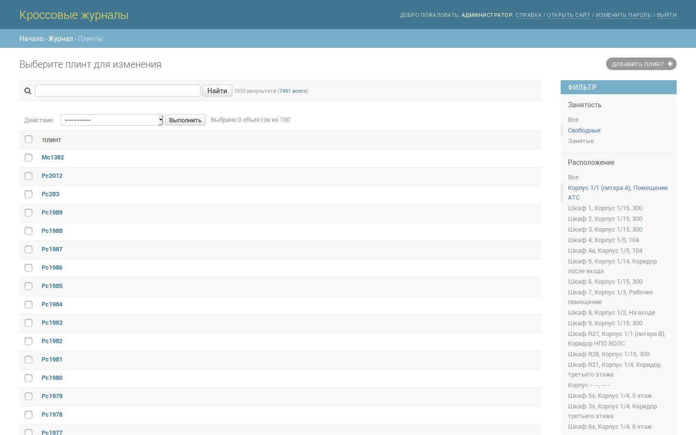
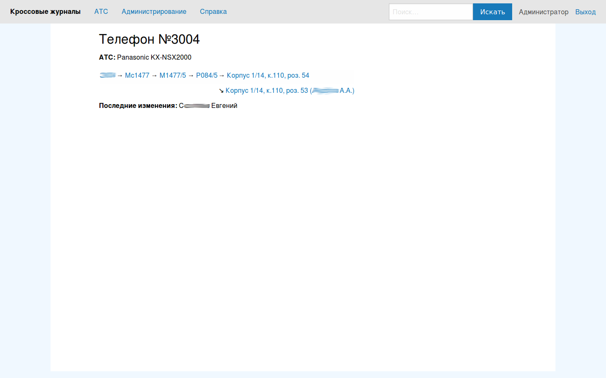

Кроссовые журналы
=================

Программа предназначена для ведения кабельного (кроссового) журнала в
телефонной сети. Упор ведётся на работу с аналоговыми линиями, однако
планируется введение возможностей, отражающих особенности работы с
цифровыми линиями.

# Возможности

Приложение имеет следующий функционал:

- ведение учета по нескольким АТС;
- отсутствие ограничения на количество точек в маршруте линии от АТС до абонента;
- маршрут от АТС до абонентов состоит из:
    + портов АТС;
    + плинтов;
    + КРТ;
    + телефонов.
- по умолчанию плинты разделяются на:
    + магистрали;
    + распределения;
    + гром-полосы.
- можно добавлять свои типы плинтов;
- в маршруте может быть неограниченное количество параллелей;
- всегда можно отследить, что и кем изменялось;
- есть возможность отменить сделанные ранее изменения;
- можно быстро проложить новый маршрут, используя фильтры по шкафам и свободным плинтам;
- один абонент может иметь несколько телефонов.

# Скриншоты

Главная страница

Детализация номеров по АТС

Админка

Поиск свободных плинтов в шкафу

Карточка телефона

Редактирование плинта

[Страница изменения абонента](http://storage2.static.itmages.ru/i/17/1116/h_1510865508_8947930_ca76b29868.png)

# Установка

## Зависимости

Для работы приложения в системе должны быть установлены:

1. Python 3
2. Django >= 1.11, работа на более ранних версиях не проверялась
3. Приложения Django:
    + django-extensions
    + django-polymorphic
    + django-simple-history
4. Одна из поддерживаемых Django СУБД (по умолчанию — PostgreSQL)

## Установка

## Запуск

# Roadmap

### 0.3

- Отображение телефонов, находящихся в редактируемом помещении;
- улучшение стилей печати;
- поддержка примечаний к портам АТС и плинтам;
- запрет указания занятого порта АТС источником.

### 0.4

- Расширенный поиск на основном сайте;
- массовое создание плинтов;
- более точное хранение и отображение записей истории;
- …
